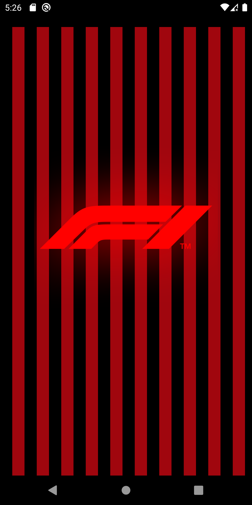
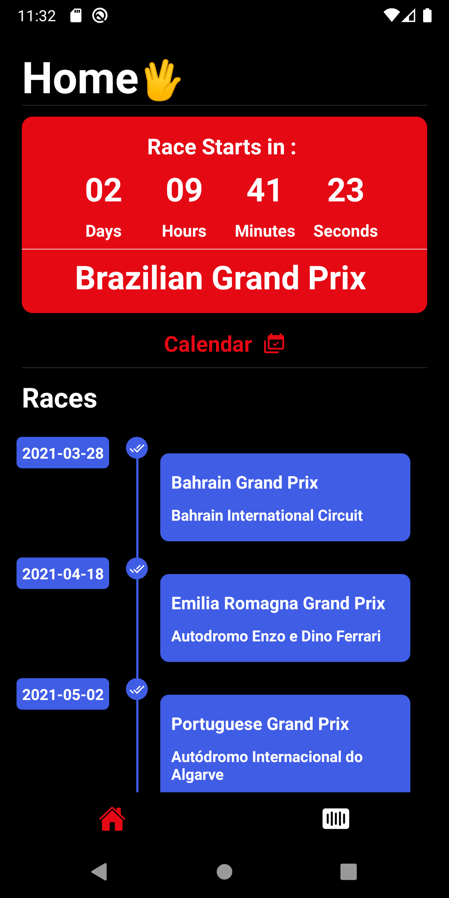
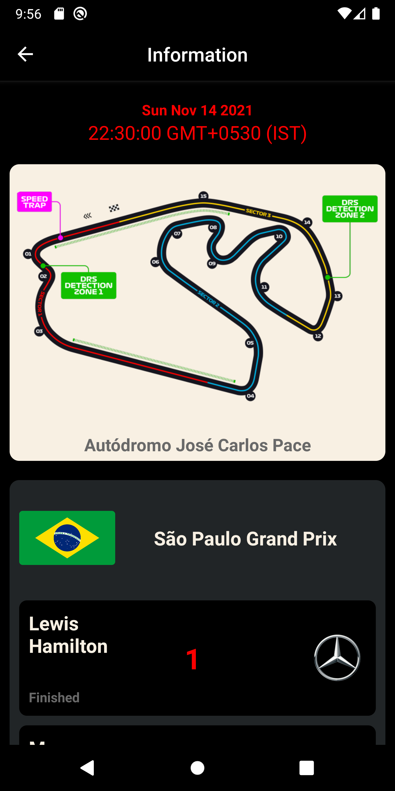
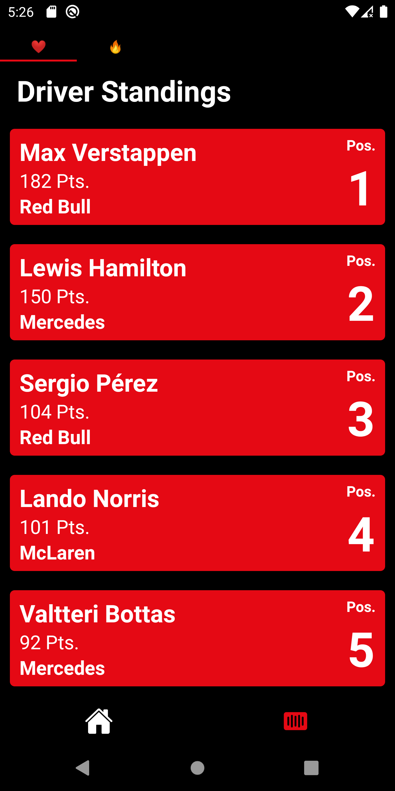
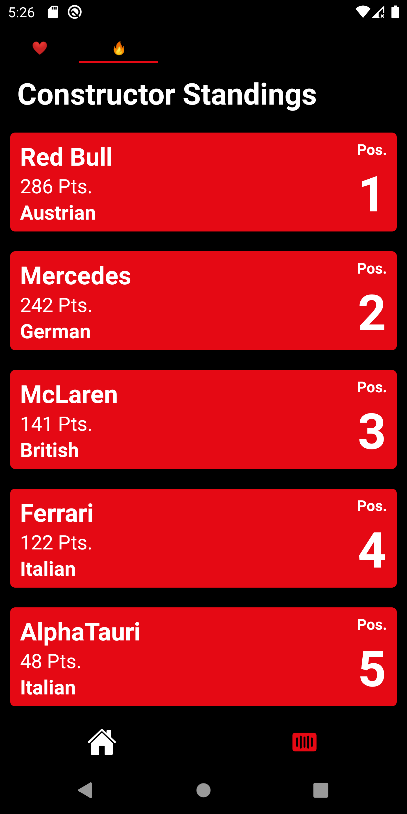
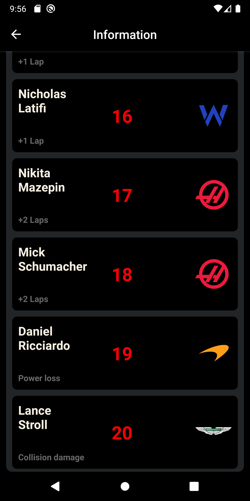

# F1-Race-Calendar-App

- This is a F1 calendar app that is made with Ergast Developer API
- Version 2 Released.

- Play Store Release Date 2022 with updated 2022 f1 info.
<p>
  
</p>

## Installation

```bash
Clone This Repo To Your PC

Run npm install

Run The App
```

### Built With

- React Native
- Ergast Developer API
- React Navigation 6.0 

### Sample Preview


 <table>
  <tr>
    <td>SplashScreen</td>
    <td>Home Screen</td>
    <td>Race Info</td>
    <td>Driver Page</td>
    <td>Constructor Page</td>
   <td>Info Page</td>
  </tr>
  <tr>
    <td valign="top"></td>
    <td valign="top"></td>
    <td valign="top"></td>
    <td valign="top"></td>
    <td valign="top"></td>
   <td valign="top"></td>
  </tr>
 </table>
 
 


