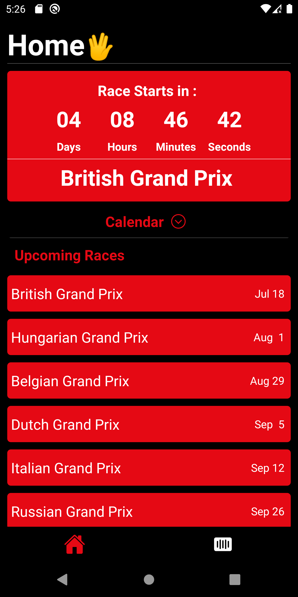

# F1-Race-Calendar-App

This is a F1 calendar app that is made with Ergast Developer API

## Installation

```bash
Clone This Repo To Your PC

Run npm install

Run The App
```

### Built With

- React Native
- Ergast Developer API

### Sample Preview


 <table>
  <tr>
    <td>SplashScreen</td>
     <td>Home Screen</td>
     <td>Driver Page</td>
    <td>Constructor Page</td>
  </tr>
  <tr>
    <td valign="top"></td>
    <td valign="top"></td>
    <td valign="top"></td>
    <td valign="top"></td>
  </tr>
 </table>
 
 


